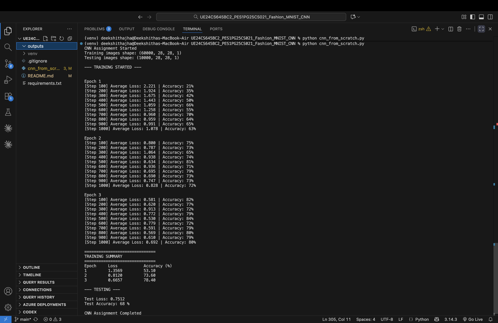
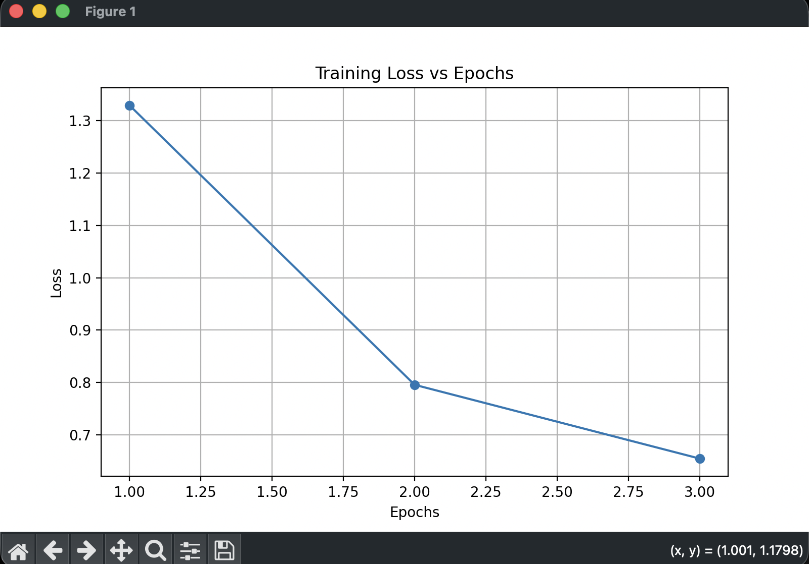
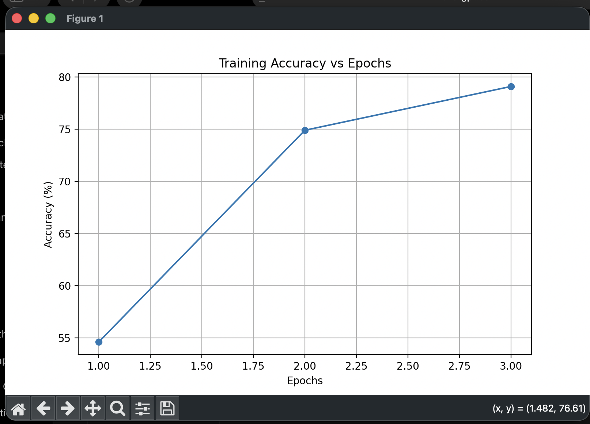

# Fashion MNIST CNN From Scratch

## Project Overview

This project implements a Convolutional Neural Network (CNN) completely from scratch using NumPy for image classification on the Fashion MNIST dataset.

Convolutional Neural Networks are specialized neural architectures used for computer vision tasks such as image classification and object recognition. CNNs use convolution operations to identify important patterns in images.

The objective of this assignment is to understand the internal working of CNNs by manually implementing:
- Convolution Layer
- MaxPooling Layer
- Flattening
- Fully Connected Layer
- Forward Propagation
- Backpropagation
- Weight Updates
- CNN Training Loop

The model is trained and evaluated on the Fashion MNIST dataset.

---

# Aim of the Assignment

The aim of this assignment is to build a CNN from basic principles and understand how convolutional neural networks work internally.

The project includes:
- Manual implementation of CNN layers
- Forward pass
- Backward pass (Backpropagation)
- CNN training
- CNN evaluation on the Fashion MNIST dataset

---

# Dataset Used

## Fashion MNIST

Fashion MNIST is a grayscale image dataset consisting of:
- 70,000 total images
- 10 classes
- Image size: 28 × 28 pixels

Classes include:
- T-shirt/top
- Trouser
- Pullover
- Dress
- Coat
- Sandal
- Shirt
- Sneaker
- Bag
- Ankle boot

Dataset Source:
tensorflow.keras.datasets.fashion_mnist

---

# Technologies Used

- Python
- NumPy
- Matplotlib
- TensorFlow/Keras (only for dataset loading)

---

# CNN Architecture

The CNN model follows the architecture below:

Input Image (28x28x1)
        ↓
Convolution Layer (8 Filters)
        ↓
MaxPooling Layer
        ↓
Flatten Layer
        ↓
Fully Connected Softmax Layer
        ↓
Output Prediction (10 Classes)

---

# Definitions of Implemented Components

## Convolution Layer

A convolution layer extracts important features from an image using learnable filters. The filters slide across the image and generate feature maps that help the CNN identify patterns such as edges, textures, and shapes.

---

## Forward Pass

The forward pass is the process where input data passes through the CNN layers sequentially to generate predictions.

Flow:
Input → Convolution → MaxPooling → Flatten → Fully Connected Layer → Output

---

## Backward Pass

The backward pass performs backpropagation by calculating gradients of the loss function and updating weights using gradient descent to improve model performance.

---

## MaxPooling Layer

The MaxPooling layer reduces the spatial dimensions of feature maps by selecting the maximum value from small regions of the input. This helps reduce computation and retain important features.

---

## Fully Connected Layer

The Fully Connected Layer connects all neurons from the flattened feature maps to the output layer. Softmax activation function is used to generate probability scores for classification.

---

## Training Function

The training function performs:
- Forward propagation
- Loss calculation
- Backpropagation
- Weight updates

This process is repeated over multiple epochs to train the CNN model.

---

## CNN Model Evaluation

The trained CNN model is evaluated using test images from the Fashion MNIST dataset. Model performance is measured using test accuracy and test loss.

---

# Features Implemented

## Convolution Layer
- Manual 3×3 convolution filters
- Feature extraction
- Forward propagation
- Backpropagation

## MaxPooling Layer
- 2×2 max pooling
- Dimensionality reduction
- Backward propagation

## Flatten Layer
- Converts feature maps into a one-dimensional vector for classification

## Fully Connected Layer
- Softmax activation
- Weight initialization
- Forward propagation
- Backpropagation

## Training
- Cross entropy loss
- Gradient descent
- Weight updates
- Multi epoch training

---

# Training Details

- Epochs: 3
- Learning Rate: 0.005
- Training Samples Used: 1000
- Testing Samples Used: 100
- Activation Function Used: Softmax
- Loss Function Used: Cross Entropy Loss

---

# Output

The model successfully learns during training and achieves approximately:
- Training Accuracy: ~80%
- Testing Accuracy: ~68%

---

# Output Screenshots

## Training Output



---

## Loss Graph



---

## Accuracy Graph



---

# How To Run The Project

## Step 1

Clone the repository:

```bash
git clone <repository_link>
```

---

## Step 2

Open the project folder in VS Code.

---

## Step 3

Activate virtual environment.

### Mac/Linux

```bash
source venv/bin/activate
```

### Windows

```bash
venv\Scripts\activate
```

---

## Step 4

Install required libraries:

```bash
pip install numpy matplotlib tensorflow
```

---

## Step 5

Run the program:

```bash
python cnn_from_scratch.py
```

---

# Project Structure

```text
UE24CS645BC2_PES1PG25CS021_Fashion_MNIST_CNN/
│
├── outputs/
│   ├── accuracy_graph.png
│   ├── loss_graph.png
│   └── training_output.png
│
├── cnn_from_scratch.py
├── README.md
├── requirements.txt
└── .gitignore
```

---

# Results

The CNN model was successfully trained using manual forward and backward propagation techniques. The model learned image features from the Fashion MNIST dataset and achieved good classification accuracy for a CNN implemented completely from scratch using NumPy.

The model showed decreasing loss and increasing accuracy across epochs, demonstrating successful learning through backpropagation and gradient descent.

---

# Learning Outcomes

Through this project, the following concepts were understood:
- CNN Architecture
- Convolution Operations
- Pooling Operations
- Forward Propagation
- Backpropagation
- Weight Optimization
- Gradient Descent
- Image Classification using Deep Learning

---

# Author

Deekshitha Jha  
USN: PES1PG25CS021